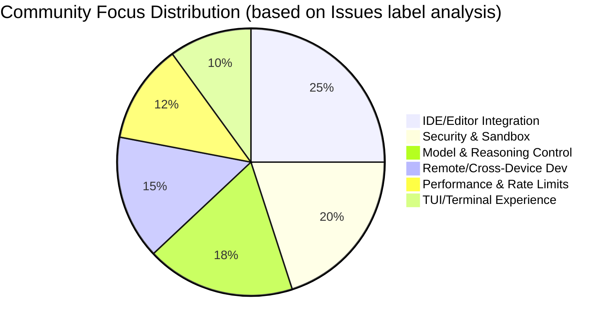

# AI CLI Tools Community Daily Digest 2026-02-25

> Generated: 2026-02-25 01:41 UTC | Tools covered: 6

- [Claude Code](https://github.com/anthropics/claude-code)
- [OpenAI Codex](https://github.com/openai/codex)
- [Gemini CLI](https://github.com/google-gemini/gemini-cli)
- [Kimi Code CLI](https://github.com/MoonshotAI/kimi-cli)
- [OpenCode](https://github.com/anomalyco/opencode)
- [Qwen Code](https://github.com/QwenLM/qwen-code)

---

## Cross-Tool Comparison

# AI CLI Tools Ecosystem Cross-Comparison Report | 2026-02-25

---

## 1. Ecosystem Overview

The current AI CLI tools ecosystem exhibits a **"three powers, many contenders"** landscape: Claude Code and OpenAI Codex hold first-mover advantage with enterprise-grade features and stability, Gemini CLI seeks differentiated breakthroughs through aggressive Agent architecture refactoring, while Kimi CLI and OpenCode focus on rapid iteration in specific scenarios (enterprise network adaptation, multi-model compatibility). The overall technical direction is evolving from "single conversation tool" to "Multi-Agent orchestration platform," with Windows platform stability, enterprise security compliance, and remote development capabilities becoming shared battlegrounds. Technical choices such as Rust refactoring (Codex), Hook plugin system (Claude), and ReAct loop standardization (Gemini) are shaping each tool's long-term architectural boundaries.

---

## 2. Tool Activity Comparison

| Tool | Today's Issues | Today's PRs | Releases | Key Developments |
|:---|:---:|:---:|:---|:---|
| **Claude Code** | 8 active (2 severe regressions) | 8 (3 merged) | v2.1.53 → v2.1.52 consecutive fixes | Windows Bash tool severe regression, Hook ecosystem rapidly forming |
| **OpenAI Codex** | 10 active (3 high-heat) | 10 (dense Rust iteration) | rust-v0.105.0-alpha.17/18 | Sub-agent config milestone landed, rate limit controversy heating up |
| **Gemini CLI** | 10 active | 10 (1 architecture-level) | v0.30.0-preview.6 / v0.29.7 | Agent v1 refactoring PR enters review, Plan Mode experience controversy |
| **Kimi CLI** | 6 active (4 connection failures) | 7 (1 core merged) | **v1.13.0** | Retryable Provider architecture released, Linux connection issues erupting |
| **OpenCode** | 10 active | 10 (feature-dense) | **v1.2.11** | workspace-serve experimental feature, TUI performance continues optimizing |
| **Qwen Code** | — | — | — | Data fetch failed |

> **Activity ranking**: Codex ≈ Claude Code ≈ Gemini CLI ≈ OpenCode > Kimi CLI

---

## 3. Shared Feature Focus Areas

| Feature Area | Tools Involved | Specific Needs |
|:---|:---|:---|
| **Windows Platform Stability** | Claude Code, Codex, Gemini CLI, OpenCode | Claude Bash tool EINVAL regression; Codex IDE extension lag; Gemini scroll flickering; OpenCode path/paste issues |
| **Enterprise Network/Security Compliance** | Claude Code, Codex, Kimi CLI, OpenCode | Kimi SSL_CERT_FILE, Azure deployment; Codex sensitive file exclusion; Claude remote control permissions; OpenCode Bedrock IAM |
| **Multi-Agent Orchestration** | Codex, Gemini CLI, Claude Code | Codex sub-agent config (#11701 closed); Gemini Agent v1 refactoring (#19982); Claude batch Agent termination optimization |
| **Session Persistence & Recovery** | Claude Code, Gemini CLI, OpenCode | Claude sessions disappear after logout; Gemini exit recovery path unclear; OpenCode `/compact` data loss |
| **Rate Limiting & Billing Transparency** | Codex, Kimi CLI | Codex abnormal 22% weekly quota consumption (#12728); Kimi 413 context overflow |
| **Remote/Cross-Device Development** | Codex, Claude Code, Gemini CLI | Codex SSH remote development (#10450); Claude `claude remote-control`; Gemini SSH tool (#19541) |

---

## 4. Differentiated Positioning Analysis

| Tool | Core Feature Focus | Target User Profile | Technical Approach |
|:---|:---|:---|:---|
| **Claude Code** | Enterprise collaboration (Cowork), Hook plugin ecosystem, deep VS Code integration | Medium-to-large teams, enterprise developers, custom workflow needs | TypeScript-led, Hookify plugin system open, emphasizing "human-AI collaboration" over full automation |
| **OpenAI Codex** | Rust core performance, sub-agent orchestration, TUI interaction experience, multi-model scheduling | Performance-sensitive developers, Multi-Agent scenarios, deep OpenAI ecosystem users | **Full Rust refactoring**, Skills system security controls, Plan/Default dual-mode refinement |
| **Gemini CLI** | Agent architecture platformization, Plan Mode planning-execution separation, Google ecosystem native | Users seeking "autopilot" coding, Google Cloud users, experimental feature enthusiasts | **ReAct loop standardization**, Agent v1 abstraction layer evolving toward SDK, Conductor strategy engine |
| **Kimi CLI** | Network resilience (retryable Provider), enterprise proxy adaptation, Wire mode Agent control | Chinese enterprise users, complex network environment scenarios, domestic model support needs | Rust (kosong framework), Provider-level circuit breaking and degradation, emphasizing "usable on weak networks" |
| **OpenCode** | Multi-model compatibility (Kimi/Gemini/GPT-5/Devstral), TUI performance, open ecosystem | Multi-model strategy users, cutting-edge model feature seekers, self-hosting needs | TypeScript, modular provider system, rapidly following third-party model API changes |

---

## 5. Community Activity & Maturity

### Maturity Matrix (based on Issue handling efficiency + feature completeness)

| Tool | Community Heat | Iteration Speed | Stability | Docs/Ecosystem | Overall Maturity |
|:---|:---:|:---:|:---:|:---:|:---:|
| **Claude Code** | ⭐⭐⭐⭐⭐ | ⭐⭐⭐⭐☆ | ⭐⭐⭐☆☆* | ⭐⭐⭐⭐☆ | **High** (Windows dragging it down recently) |
| **OpenAI Codex** | ⭐⭐⭐⭐⭐ | ⭐⭐⭐⭐⭐ | ⭐⭐⭐⭐☆ | ⭐⭐⭐☆☆ | **Medium-High** (Rust refactoring period volatility) |
| **Gemini CLI** | ⭐⭐⭐⭐☆ | ⭐⭐⭐⭐⭐ | ⭐⭐⭐☆☆ | ⭐⭐⭐☆☆ | **Medium** (Architecture refactoring period) |
| **Kimi CLI** | ⭐⭐⭐☆☆ | ⭐⭐⭐⭐☆ | ⭐⭐⭐☆☆* | ⭐⭐⭐☆☆ | **Medium** (1.13.0 critical upgrade) |
| **OpenCode** | ⭐⭐⭐⭐☆ | ⭐⭐⭐⭐⭐ | ⭐⭐⭐☆☆ | ⭐⭐⭐⭐☆ | **Medium-High** (Feature catch-up period) |

*\* Severe regression or concentrated failures today*

### Key Assessments

- **Most Active Communities**: Claude Code (Hook ecosystem contributors emerging), OpenAI Codex (Rust refactoring daily iterations)
- **Fastest Iteration Phase**: Gemini CLI (Agent v1 architecture refactoring), OpenCode (dense multi-model adaptation)
- **Stability Risk Period**: Claude Code (v2.1.53 Windows regression), Kimi CLI (1.13.0 Linux connection failures)

---

## 6. Notable Trend Signals

| Trend Signal | Evidence Source | Developer Reference Value |
|:---|:---|:---|
| **"Plan Mode" becoming standard, but experience diverging** | Claude, Codex, Gemini all have implementations; Gemini #20143 "too eager to implement" gets P1 tag | When choosing tools, verify: is the planning-execution boundary clear, are user intervention points sufficient |
| **Hook/Plugin systems from "nice-to-have" to "must-have"** | Claude Hookify ecosystem (#28294 etc.), OpenCode `.agents/skills/` standard path request | Evaluate tools' extensibility architecture: does it support permission interception, field mapping, custom workflows |
| **Rust becoming preferred for performance-sensitive CLIs** | Codex full Rust refactoring, Kimi CLI based on kosong Rust framework | Tech selection focus: team Rust capability reserves, build toolchain maturity |
| **"Weak network resilience" becoming a competitive differentiator** | Kimi 1.13.0 retryable Provider, Claude session recovery anxiety | Verify before enterprise deployment: auto-recovery mechanisms under network jitter scenarios |
| **Multi-model strategies forcing "provider abstraction layer" maturity** | OpenCode 10+ provider adaptations, Codex custom model metadata issues | Avoid vendor lock-in: choose tools with standardized provider interfaces |
| **Windows developer experience remains an industry weakness** | All 5 tools have Windows-specific Issues, density significantly higher than macOS/Linux | Cross-platform teams should reserve dedicated Windows testing resources, or prioritize WSL approaches |

---

*Report based on 2026-02-25 public community data. PoC validation recommended for specific use cases*

---

## Individual Tool Reports

<details>
<summary><strong>Claude Code</strong> — <a href="https://github.com/anthropics/claude-code">anthropics/claude-code</a></summary>

# Claude Code Community Daily Digest | 2026-02-25

## Today's Overview

Today the community focused on two main themes: **Windows platform Bash tool severe regression** (v2.1.53 multiple related Issues erupting), and **VS Code extension command registration issue** already emergency-fixed in v2.1.52. Meanwhile, the remote control feature (`claude remote-control`) misleading error messages for personal accounts sparked UX controversy, with the community calling for clearer permission documentation.

---

## Version Releases

### v2.1.53 → v2.1.52 Consecutive Fixes
| Version | Key Fixes |
|:---|:---|
| **v2.1.53** | Fix UI flickering (briefly disappearing after input submission), batch Agent termination notification aggregation, graceful shutdown issues |
| **v2.1.52** | **Emergency fix**: VS Code extension crashing on Windows (`command 'claude-vscode.editor.openLast' not found`) |

🔗 [v2.1.53 Release](https://github.com/anthropics/claude-code/releases/tag/v2.1.53) | [v2.1.52 Release](https://github.com/anthropics/claude-code/releases/tag/v2.1.52)

> ⚠️ **Note**: v2.1.53 introduced a new Windows Bash tool regression, see Issues below.

---

## Community Hot Issues

### 🔴 Severe Regressions (Immediate Attention Needed)

| # | Title | Status | Comments | Core Issue |
|:---|:---|:---|:---:|:---|
| [#28333](https://github.com/anthropics/claude-code/issues/28333) | Bash tool completely broken on Windows: `EINVAL: invalid argument` | 🟡 OPEN | 6 | **v2.1.53 critical regression**—any Bash command fails, temp file path creation abnormal |
| [#28343](https://github.com/anthropics/claude-code/issues/28343) | Bash tool EINVAL persists—v2.1.45's stdio fd regression not fully fixed | 🟡 OPEN | 2 | Traces back to v2.1.45 series issues, Git Bash/Scoop install environments affected |
| [#28344](https://github.com/anthropics/claude-code/issues/28344) | `EINVAL` fails on non-C: drives | 🟢 CLOSED | 3 | Triggered when path contains hyphens or crosses drives, quickly closed but related issues persist |
| [#28347](https://github.com/anthropics/claude-code/issues/28347) | Bash fails when working directory contains hyphens | 🟢 CLOSED | 2 | Similar to #28344, downgrading to v2.1.52 restores functionality |

### 🔶 High-Interaction Topics

| # | Title | Status | Comments/👍 | Community Focus |
|:---|:---|:---|:---:|:---|
| [#26805](https://github.com/anthropics/claude-code/issues/26805) | Cowork UI: responses don't render, "working through complex response" hangs indefinitely | 🟢 CLOSED | 44/24 | **Resolved**—collaboration mode core experience issue, fix received community approval |
| [#20696](https://github.com/anthropics/claude-code/issues/20696) | Conversation compression intermittent failure or deadlock (regression after Jan 15) | 🟡 OPEN | 36/8 | **Long-standing issue**—affects claude.ai web/mobile, cross-platform context management crisis |
| [#28098](https://github.com/anthropics/claude-code/issues/28098) | `claude remote-control` shows misleading "contact admin" error for personal accounts | 🟡 OPEN | 21/14 | **UX design flaw**—Pro/Max users have no admin to contact, permission model unclear |
| [#21576](https://github.com/anthropics/claude-code/issues/21576) | Task execution escapes to PowerShell then becomes unresponsive | 🟡 OPEN | 21/1 | Windows platform stability, task execution flow losing control |
| [#26452](https://github.com/anthropics/claude-code/issues/26452) | Sessions disappear after logout/restart—how to emergency recover? | 🟡 OPEN | 20/8 | **Data safety anxiety**—user session persistence mechanism questioned |
| [#26638](https://github.com/anthropics/claude-code/issues/26638) | Desktop app crashes after launch, 8 claude.exe processes unresponsive | 🟢 CLOSED | 14/31 | Windows multi-process architecture stability, high 👍 reflecting widespread impact |

---

## Important PR Progress

| # | Title | Status | Core Contribution |
|:---|:---|:---|:---|
| [#28294](https://github.com/anthropics/claude-code/pull/28294) | Add PermissionRequest Hook workaround for piped commands | 🟡 OPEN | Fixes regression where Plan Agent still prompts permissions for whitelisted piped commands, provides `examples/hooks/piped_command_permission_fix.py` |
| [#28065](https://github.com/anthropics/claude-code/pull/28065) | Batch fix small open PRs (Hookify field mapping, Python 3.8 compat, etc.) | 🟡 OPEN | Integrates #24321 and other community contributions: fixes Write/Edit field mapping, `|` union type syntax, undefined variable references |
| [#28062](https://github.com/anthropics/claude-code/pull/28062) | Batch fix actionable community PRs (Hookify import paths, etc.) | 🟡 OPEN | Integrates #27796: changes `hookify.core.*` to `core.*`, resolves `No module named 'hookify'` error |
| [#28088](https://github.com/anthropics/claude-code/pull/28088) | Fix incorrect Python import paths in hookify plugin | 🟢 CLOSED | Resolves absolute import failure in `CLAUDE_PYTHON_PATH` environments |
| [#28243](https://github.com/anthropics/claude-code/pull/28243) | Add non-write user check workflow | 🟢 CLOSED | Security enhancement: detects `allowed_non_write_users` modifications and triggers security review comments |
| [#27911](https://github.com/anthropics/claude-code/pull/27911) | Use wrapper script for label operations in Issue triage | 🟢 CLOSED | Extracts triage prompt as `/triage-issue` command, uses `edit-issue-labels.sh` instead of raw `gh issue edit`, with label validation |
| [#26565](https://github.com/anthropics/claude-code/pull/26565) | Claude/general session dg oce | 🟡 OPEN | Session management related (specific details TBD) |
| [#28355](https://github.com/anthropics/claude-code/pull/28355) | Add files via upload | 🟡 OPEN | Content TBD (newly submitted) |

---

## Feature Request Trends

Based on 50 active Issue analysis, community priority:

```
1. [Stability] Windows platform toolchain reliability  ████████████████████  Explosive growth
2. [Core Experience] Conversation compression & context mgmt ████████████████░░░░░  Long-term pain point
3. [IDE Integration] VS Code extension robustness     ██████████████░░░░░░░  Recently urgent
4. [Permission Model] Remote control & account clarity ██████████░░░░░░░░░░░  New feature friction
5. [Data Safety] Session persistence & recovery        █████████░░░░░░░░░░░░  User anxiety
6. [Cross-Platform] WSL support (Windows power users)  ██████░░░░░░░░░░░░░░░  Differentiated need
```

**Emerging Trend**: The Hook system (`hookify`) plugin ecosystem is forming, with community contributions concentrated on permission interception, field mapping, and import path extension points.

---

## Developer Concerns

### 🔥 Immediate Pain Points
| Issue | Scope | Workaround |
|:---|:---|:---|
| **Bash tool EINVAL** | Windows v2.1.53 users | **Downgrade to v2.1.52** |
| **VS Code command not found** | Windows extension users | Update to v2.1.52+ |
| **Session loss** | Desktop users | Avoid manual logout, watch auto-save status |

### 📣 High-Frequency Requests
1. **More transparent release notes**—v2.1.53 Bash regression not flagged in changelog
2. **Dedicated Windows QA process**—Recent Windows-specific bug density significantly higher than macOS/Linux
3. **Remote control permission docs**—Personal vs. enterprise account capability boundaries need clear distinction
4. **Hook development documentation**—Plugin system growing rapidly, official best practice guide missing
5. **Conversation compression visibility**—Users want to understand when/how compression happens, rather than passively accepting it

### 💡 Technical Debt Signals
- Temp file path handling (`C:\Users\...\AppData\Local\Temp\claude\...`) has had encoding/special character issues on Windows multiple times
- `tmux` integration has race conditions in team Agent scenarios (shell initialization timing)
- Cost metrics (`cost_usage_total`) model pricing mapping errors affecting enterprise user billing trust

---

*Daily digest based on GitHub public data, does not represent Anthropic's official position.*

</details>

<details>
<summary><strong>OpenAI Codex</strong> — <a href="https://github.com/openai/codex">openai/codex</a></summary>

# OpenAI Codex Community Daily Digest | 2026-02-25

## Today's Overview

Today the community focused on **Rust core refactoring** and **multi-platform stability fixes**. Two Rust alpha versions (v0.105.0-alpha.17/18) were released back-to-back, while TUI shortcut compatibility, sandbox permission control, and model switching experience became PR priorities. On the Issues side, rate limit abnormal consumption and remote development demand continued heating up.

---

## Version Releases

### rust-v0.105.0-alpha.18 & alpha.17
| Version | Release Date |
|:---|:---|
| [v0.105.0-alpha.18](https://github.com/openai/codex/releases/tag/rust-v0.105.0-alpha.18) | 2026-02-25 |
| [v0.105.0-alpha.17](https://github.com/openai/codex/releases/tag/rust-v0.105.0-alpha.17) | 2026-02-25 |

> Note: Release notes are brief; specific changes need to be analyzed via PRs. From associated PRs, main changes involve musl build fixes, OAuth permission adjustments, and shell privilege escalation mechanism refactoring.

---

## Community Hot Issues (Top 10)

| # | Status | Topic | Heat | Key Highlights |
|:---|:---|:---|:---|:---|
| [#11701](https://github.com/openai/codex/issues/11701) | ✅ CLOSED | Sub-agent configuration & orchestration | 👍38 / 💬60 | **Milestone feature landed**: Support configuring sub-agent models and reasoning intensity via `~/.codex/config.toml`, the long-awaited Multi-Agent orchestration capability enters usable stage |
| [#2847](https://github.com/openai/codex/issues/2847) | 🟡 OPEN | Sensitive file exclusion mechanism | 👍214 / 💬54 | **Security essential**: `node_modules/` and similar directories' search vs. privacy protection conflict, community suggests `.codexignore` + global ignore dual-track approach |
| [#2558](https://github.com/openai/codex/issues/2558) | 🟡 OPEN | Zellij terminal scroll truncation | 👍76 / 💬35 | **Terminal compatibility**: TUI rendering issues in terminal multiplexers, affecting mainstream development workflows |
| [#10450](https://github.com/openai/codex/issues/10450) | 🟡 OPEN | Desktop SSH remote development | 👍189 / 💬25 | **VS Code migration barrier**: Codex Desktop lacks Remote-SSH equivalent capability, blocking server-side development scenarios |
| [#12674](https://github.com/openai/codex/issues/12674) | ✅ CLOSED | Rate limit false trigger | 👍15 / 💬15 | **Server-side issue**: 429 errors appearing when quota is sufficient, quickly responded and closed by officials |
| [#12092](https://github.com/openai/codex/issues/12092) | 🟡 OPEN | Desktop auto-scroll broken | 👍12 / 💬13 | **Regression bug**: Experience degraded after v26.217.1959 update, affecting long conversation browsing |
| [#12100](https://github.com/openai/codex/issues/12100) | ✅ CLOSED | Custom model metadata missing | 👍3 / 💬17 | **OCA ecosystem**: `oca/gpt-5-codex` model recognition issue, third-party provider integration pain point |
| [#10571](https://github.com/openai/codex/issues/10571) | 🟡 OPEN | "Bad request" mystery error | 👍1 / 💬13 | **Diagnostic difficulty**: GPT-5.2 xhigh specific scenario errors, lacking effective error information |
| [#9224](https://github.com/openai/codex/issues/9224) | 🟡 OPEN | CLI remote control | 👍30 / 💬8 | **Cross-device collaboration**: Control desktop Codex CLI from phone ChatGPT App, community workaround exists |
| [#12728](https://github.com/openai/codex/issues/12728) | 🟡 OPEN | Rate limit abnormal consumption | 👍0 / 💬3 | **Billing anxiety**: User reports single day consuming 22% weekly quota, usage pattern unchanged, suspected backend billing change |

---

## Important PR Progress (Top 10)

| # | Author | Core Changes | Technical Value |
|:---|:---|:---|:---|
| [#12706](https://github.com/openai/codex/pull/12706) | @charley-oai | **Enable `request_user_input` in Default mode** | Breaking Plan mode exclusive interaction restriction, Default mode can also proactively ask users |
| [#12730](https://github.com/openai/codex/pull/12730) | @bolinfest | **Shell escalation checks Skill policies** | Security hardening: Skill script execution requires explicit user approval, preventing silent privilege escalation |
| [#12719](https://github.com/openai/codex/pull/12719) | @bolinfest | **Arg0DispatchPaths passes helper executable paths** | Eliminates `PATH` scanning fragility, improves cross-environment reliability |
| [#12727](https://github.com/openai/codex/pull/12727) | @charley-oai | **TUI resume/fork uses thread_id resolution** | Session management precision, resolving working directory ambiguity in multi-thread scenarios |
| [#12725](https://github.com/openai/codex/pull/12725) | @fjord-oai | **Fix image attachments in js_repl nested tool calls** | Restores `view_image` expected behavior in JS REPL |
| [#12720](https://github.com/openai/codex/pull/12720) | @sayan-oai | **musl build adds `AWS_LC_SYS_NO_JITTER_ENTROPY=1`** | Emergency fix for Rust release pipeline, unblocking jitterentropy linkage |
| [#12715](https://github.com/openai/codex/pull/12715) | @aibrahim-oai | **App-server v2 real-time conversation API** | Experimental real-time session interface, paving way for voice/streaming interaction |
| [#12703](https://github.com/openai/codex/pull/12703) | @fcoury | **Ctrl+O quick-switch recent models** | Experience optimization: demand for fast/slow model switching surged after 5.3-spark release |
| [#12702](https://github.com/openai/codex/pull/12702) | @viyatb-oai | **macOS Seatbelt network and Unix Socket handling improvements** | Sandbox security refinement: dual-stack local binding + explicit AF_UNIX permissions |
| [#12660](https://github.com/openai/codex/pull/12660) | @alexsong-oai | **External agent config detection and import** | Ecosystem interop: auto-detect and import third-party Agent configurations |

---

## Feature Request Trends



**Three Main Lines**:
1. **Enterprise Security** — Sensitive file isolation (#2847), sandbox permission refinement (#12702), Skill execution controls (#12730)
2. **Flexible Model Scheduling** — Sub-agent orchestration (#11701), quick model switching (#12703), custom model metadata (#12380)
3. **Remote Development Closure** — SSH remote hosts (#10450), CLI remote control (#9224), cross-device session sync

---

## Developer Concerns

| Pain Point | Representative Issue | Community Request |
|:---|:---|:---|
| **Rate limit black box** | #12674, #12728, #4095 | Quota consumption visualization, abnormal billing appeal process |
| **Error messages opaque** | #10571, #12114 | "Bad request" errors need detailed context attached |
| **Windows second-class citizen** | #12161, #12673 | IDE extension lag, build hang issues concentrated |
| **Context window anxiety** | #9046, #11440 | Graceful degradation mechanism after 413/context exhaustion |
| **Third-party ecosystem compat** | #12100, #12114, #12669 | OpenRouter, vLLM and other unofficial endpoint support |

---

*Daily digest based on GitHub public data, does not represent OpenAI's official position.*

</details>

<details>
<summary><strong>Gemini CLI</strong> — <a href="https://github.com/google-gemini/gemini-cli">google-gemini/gemini-cli</a></summary>

# Gemini CLI Community Daily Digest | 2026-02-25

---

## 1. Today's Overview

Today the community focused on **Plan Mode experience optimization** and **Agent architecture evolution**: v0.30.0-preview.6 and v0.29.7 dual-version patches released, while the Agent v1 core refactoring PR entered review. Developers frequently reported Plan Mode "too eagerly jumping to implementation" and interaction experience issues, showing feature maturity remains the primary focus area.

---

## 2. Version Releases

| Version | Type | Core Update |
|:---|:---|:---|
| **[v0.30.0-preview.6](https://github.com/google-gemini/gemini-cli/releases/tag/v0.30.0-preview.6)** | Preview patch | Cherry-pick fix d96bd05, continuing preview.5 stability improvements |
| **[v0.30.0-nightly.20260224](https://github.com/google-gemini/gemini-cli/releases/tag/v0.30.0-nightly.20260224.544df749a)** | Nightly build | Core refactoring: session conversion logic migrated to core layer; fixed manual model selection not persisting on restart |
| **[v0.29.7](https://github.com/google-gemini/gemini-cli/releases/tag/v0.29.7)** | Stable patch | Same fix as preview.6, targeting v0.29 stable branch |

> **Note**: The v0.30.0-nightly "Persist manual model selection on restart" fix also resolves the long-complained configuration loss issue.

---

## 3. Community Hot Issues

| # | Title | Priority | Comments | Key Value |
|:---|:---|:---|:---:|:---|
| [#20142](https://github.com/google-gemini/gemini-cli/issues/20142) | AskUser open questions don't support Ctrl+R history search | need-triage | 8 | **High-frequency interaction pain point**: Users can't quickly recall history input in long conversations, severely impacting multi-turn task efficiency |
| [#20143](https://github.com/google-gemini/gemini-cli/issues/20143) | Plan Mode too eager to jump to implementation | **P1** | 5 | **Core experience defect**: Agent jumps to coding before planning is complete, breaking the "plan first, execute second" design intent |
| [#20177](https://github.com/google-gemini/gemini-cli/issues/20177) | AskUser used for shell command confirmation instead of standard tool confirmation | need-triage | 4 | **Interaction inconsistency**: Breaks user mental model, increases cognitive load |
| [#20181](https://github.com/google-gemini/gemini-cli/issues/20181) | AskUser open questions need external editor support | need-triage | 3 | Essential for long text input scenarios (e.g., Conductor track descriptions) |
| [#19514](https://github.com/google-gemini/gemini-cli/issues/19514) | AskUser outputs raw tags in Plan Mode | area/core | 3 | Rendering layer bug, directly affecting Plan Mode readability |
| [#18953](https://github.com/google-gemini/gemini-cli/issues/18953) | Complex shell commands execute extremely slowly | **P2** | 3 | Performance bottleneck: progress bars and other "UX magic" cause 100x slowdown, blocking enterprise scenarios |
| [#18896](https://github.com/google-gemini/gemini-cli/issues/18896) | Windows screen flickering/glitching on scroll | **P2** | 3 | Cross-platform stability issue, Windows user core experience damaged |
| [#20195](https://github.com/google-gemini/gemini-cli/issues/20195) | [Agents] Local Subagent Sprint 1 | area/agent | 2 | **Architecture milestone**: Multi-Agent collaboration infrastructure building initiated |
| [#20233](https://github.com/google-gemini/gemini-cli/issues/20233) | Separate remote vs. local Subagent experiments | need-triage | 1 | Security and experimental feature isolation design, affecting future extension architecture |
| [#20219](https://github.com/google-gemini/gemini-cli/issues/20219) | Terminal snapshot tests need color info support | need-triage | 1 | Engineering quality: prevent color regression, support new renderer migration |

---

## 4. Important PR Progress

| # | Title | Status | Core Contribution |
|:---|:---|:---|:---|
| [#19982](https://github.com/google-gemini/gemini-cli/pull/19982) | Agent & AgentSession v1: ReAct loop with event stream | **OPEN** | **Architecture cornerstone**: First reusable Agent abstraction layer, supporting SDK-style invocation and fine-grained event observation |
| [#20082](https://github.com/google-gemini/gemini-cli/pull/20082) | Interactive shell auto-completion | OPEN | readline-like Tab completion, covering file/directory/command paths, improving terminal efficiency |
| [#20220](https://github.com/google-gemini/gemini-cli/pull/20220) | Snapshot tests with color info support | OPEN | SVG snapshots capture ANSI colors, resolving regression test blind spots (related #20219) |
| [#19541](https://github.com/google-gemini/gemini-cli/pull/19541) | Built-in SSH tool for remote device access | OPEN | Direct remote command execution with real-time output analysis, extending DevOps scenarios |
| [#19812](https://github.com/google-gemini/gemini-cli/pull/19812) | Headless auto mode (/auto alias /headless) | OPEN | Execute single-round headless tasks in interactive sessions, auto-cancel confirmations and exit |
| [#20229](https://github.com/google-gemini/gemini-cli/pull/20229) | Extension parallel loading optimization | OPEN | ExtensionManager concurrent loading, significantly improving multi-extension startup performance |
| [#19389](https://github.com/google-gemini/gemini-cli/pull/19389) | Hide thinking shortcut hints + debounce anti-flicker | OPEN | Resolve visual interference in alternate buffer mode |
| [#19365](https://github.com/google-gemini/gemini-cli/pull/19365) | MCP tool output truncation + Unicode safety | OPEN | Prevent large output from blowing context, multi-byte character truncation safety |
| [#20244](https://github.com/google-gemini/gemini-cli/pull/20244) | Arch Linux (pacman) installation docs | OPEN | Community contribution: completing Linux distribution coverage |
| [#20240](https://github.com/google-gemini/gemini-cli/pull/20240) | Plan Mode auto model switching | **CLOSED** | Pro for planning, Flash for implementation routing strategy (merged or closed) |

---

## 5. Feature Request Trends

Based on cluster analysis of 50 active Issues:

| Trend Direction | Heat | Typical Requests |
|:---|:---:|:---|
| **Plan Mode Fine-Grained Control** | 🔥🔥🔥 | Pacing control (avoid premature implementation), editor integration, history search, tag rendering fixes |
| **Agent Architecture Extension** | 🔥🔥🔥 | Subagent local/remote separation, multi-Agent collaboration, ReAct loop standardization |
| **Terminal Interaction Experience** | 🔥🔥🔥 | Scroll performance (Windows flickering), color testing, debounce, auto-completion |
| **Context & Performance Optimization** | 🔥🔥 | Large output truncation, Token-thrifty reading (Tactful Extraction), smart pagination |
| **Headless/CI Integration** | 🔥🔥 | Strategy engine supporting headless, auto mode, session recovery guidance |
| **Extension & Strategy Ecosystem** | 🔥 | Extension parallel loading, strategy file packaging, Conductor strategy support |

---

## 6. Developer Concerns

### 🔴 High-Frequency Pain Points
1. **Plan Mode mental burden**: "Agent too eager to write code" (#20143) coexists with "repeatedly asking whether to enter Plan Mode" (#19312), showing state machine logic needs recalibration
2. **Windows second-class experience**: Scroll flickering (#18896), path input flickering (#20217) and other rendering issues erupting in concentration
3. **Long task execution black box**: No intelligent handling when shell command output is too large, causing false hangs or false loop detection triggers (#19519, #19520)

### 🟡 Capability Gaps
- **Session continuity**: Recovery path after exit unclear (#19379), affecting long-cycle development workflows
- **Model selection persistence**: Though fixed (v0.30.0-nightly), historical debt shows config management still needs hardening

### 🟢 Positive Signals
- **Agent v1 architecture** (#19982) and **Subagent Sprint** (#20195) show team shifting from "feature stacking" to "platform architecture"
- **Community contributions active**: SSH tool, Arch install guide, auto-completion and other PRs demonstrate ecosystem expansion intent

---

*Daily digest based on github.com/google-gemini/gemini-cli 2026-02-25 data*

</details>

<details>
<summary><strong>Kimi Code CLI</strong> — <a href="https://github.com/MoonshotAI/kimi-cli">MoonshotAI/kimi-cli</a></summary>

# Kimi Code CLI Community Daily Digest | 2026-02-25

---

## 1. Today's Overview

**Kimi CLI 1.13.0 officially released**, with the core upgrade being a retryable Chat Provider interface with automatic recovery mechanism, significantly improving reliability in unstable network scenarios. Today the community concentrated feedback on **Linux platform connection error issues**, with multiple Issues pointing to HTTP Header contamination or enterprise proxy environment compatibility. Related fix PR has been submitted and is pending review.

---

## 2. Version Releases

### [v1.13.0](https://github.com/MoonshotAI/kimi-cli/releases/tag/1.13.0) | 2026-02-24

| Component | Version |
|:---|:---|
| kimi-cli | 1.12.0 → **1.13.0** |
| kimi-code | Synced to 1.13.0 |
| kosong | 0.42.0 → **0.43.0** |

**Core Updates:**
- **Retryable Chat Provider interface** ([#1219](https://github.com/MoonshotAI/kimi-cli/pull/1219)): Implements Provider-level automatic retry and fault recovery, reducing conversation interruptions caused by transient network fluctuations
- Dependency upgrade to kosong 0.43.0

---

## 3. Community Hot Issues

| # | Title | Status | Key Info |
|:---|:---|:---|:---|
| [#1217](https://github.com/MoonshotAI/kimi-cli/issues/1217) | Image processing hangs and freezes | 🔴 Open | **v1.12.0 / macOS ARM**, multimodal scenario blocking issue, affecting image input workflow |
| [#1227](https://github.com/MoonshotAI/kimi-cli/issues/1227) | LLM provider error: Connection error | 🔴 Open | **v1.13.0 / Ubuntu 22.04**, still occurring after new version release, needs regression investigation |
| [#1226](https://github.com/MoonshotAI/kimi-cli/issues/1226) | LLM provider error: Connection error | 🔴 Open | Same as above, fails despite confirmed correct configuration, suspected network layer or auth layer issue |
| [#1220](https://github.com/MoonshotAI/kimi-cli/issues/1220) | HTTP Header contaminated by Ubuntu kernel version string | 🔴 Open | **Root cause analysis**: `Linux 6.8.0-100-generic` injected into Header causing protocol parsing failure, related fix [#1229](https://github.com/MoonshotAI/kimi-cli/pull/1229) |
| [#1224](https://github.com/MoonshotAI/kimi-cli/issues/1224) | Cannot use in JetBrains IDEA | 🔴 Open | IDE integration scenario, v25.3.2 compatibility issue, screenshots pending |
| [#1222](https://github.com/MoonshotAI/kimi-cli/issues/1222) | 413 Request Entity Too Large | 🔴 Open | **v1.12.0 / Linux**, context or file upload size exceeds limit, needs chunking strategy optimization |

**Trend Assessment**: Of today's 6 active Issues, **4 are connection/network layer failures**, concentrated on Linux environments, coinciding with the 1.13.0 release timeline. Recommend prioritizing investigation of HTTP client changes introduced with the version upgrade.

---

## 4. Important PR Progress

| # | Title | Status | Feature/Fix Key Points |
|:---|:---|:---|:---|
| [#1219](https://github.com/MoonshotAI/kimi-cli/pull/1219) | Retryable Chat Provider interface and recovery mechanism | ✅ Merged | **Core architecture upgrade**: Provider layer implements exponential backoff retry, circuit breaking degradation, state recovery |
| [#1221](https://github.com/MoonshotAI/kimi-cli/pull/1221) | Version bump to 1.13.0 | ✅ Merged | Release pipeline, syncing kosong 0.43.0 |
| [#1229](https://github.com/MoonshotAI/kimi-cli/pull/1229) | Fix HTTP Header whitespace causing h11 rejection | 🔍 Open | **Emergency fix**: `strip()` processing of Header values, directly addressing [#1220](https://github.com/MoonshotAI/kimi-cli/issues/1220) |
| [#1228](https://github.com/MoonshotAI/kimi-cli/pull/1228) | Wire mode adds steer support | 🔍 Open | **Agent control enhancement**: JSON-RPC method injects user directives, using synthetic tool result mechanism to maintain chain-of-thought coherence |
| [#1223](https://github.com/MoonshotAI/kimi-cli/pull/1223) | Azure Kimi supports default_query/custom_headers | 🔍 Open | **Enterprise deployment**: OpenAI compatibility layer extension, supporting Azure custom query parameters and headers |
| [#762](https://github.com/MoonshotAI/kimi-cli/pull/762) | Support SSL_CERT_FILE environment variable | 🔍 Open | **Enterprise proxy**: Zscaler/BlueCoat/Fortinet certificate trust scenarios |
| [#1218](https://github.com/MoonshotAI/kimi-cli/pull/1218) | Add bell_on_completion config | 🔍 Open | **UX enhancement**: Play `\a` bell on task completion, benchmarking Codex/Claude CLI, adapted for tmux multi-window scenarios |
| [#1225](https://github.com/MoonshotAI/kimi-cli/pull/1225) | Docs: add three usage modes documentation | 🔍 Open | Structured introduction of Interactive CLI / Kimi Web / Kimi ACP three interaction forms |

---

## 5. Feature Request Trends

Based on recent community feedback, three directions with rising heat:

| Direction | Representative Issue/PR | Demand Intensity |
|:---|:---|:---:|
| **Enterprise network environment adaptation** | [#762](https://github.com/MoonshotAI/kimi-cli/pull/762) [#1223](https://github.com/MoonshotAI/kimi-cli/pull/1223) [#1229](https://github.com/MoonshotAI/kimi-cli/pull/1229) | ⭐⭐⭐⭐⭐ |
| **IDE deep integration** | [#1224](https://github.com/MoonshotAI/kimi-cli/issues/1224) JetBrains issue | ⭐⭐⭐⭐☆ |
| **Agent observability & control** | [#1228](https://github.com/MoonshotAI/kimi-cli/pull/1228) steer directives [#1218](https://github.com/MoonshotAI/kimi-cli/pull/1218) completion notification | ⭐⭐⭐⭐☆ |
| **Multimodal stability** | [#1217](https://github.com/MoonshotAI/kimi-cli/issues/1217) image hang | ⭐⭐⭐☆☆ |

---

## 6. Developer Concerns

### 🔴 High-Frequency Pain Points

1. **Linux connection stability** (erupting today)
   - Symptoms: Ubuntu users concentrated reports of `Connection error` after v1.13.0 upgrade
   - Suspected root cause: HTTP Header handling changes conflicting with kernel version strings
   - Progress: [#1229](https://github.com/MoonshotAI/kimi-cli/pull/1229) fix submitted, pending merge

2. **Enterprise proxy/certificate configuration**
   - Long-term need: SSL_CERT_FILE support, custom Headers, Azure deployment
   - Progress: Multiple PRs in parallel, but [#762](https://github.com/MoonshotAI/kimi-cli/pull/762) has stalled for nearly 1 month

3. **Context size management**
   - [#1222](https://github.comgithub.com/MoonshotAI/kimi-cli/issues/1222) 413 error reflects lack of automatic chunking for large file/long conversation scenarios

### 🟡 Experience Optimization Needs

- **Async task awareness**: Completion notification when running in tmux/background ([#1218](https://github.com/MoonshotAI/kimi-cli/pull/1218) approach pending review)
- **Agent intervention capability**: Inject directives mid-run rather than restarting sessions ([#1228](https://github.com/MoonshotAI/kimi-cli/pull/1228) steer mechanism)

---

*Daily digest generated: 2026-02-25*
*Data source: github.com/MoonshotAI/kimi-cli*

</details>

<details>
<summary><strong>OpenCode</strong> — <a href="https://github.com/anomalyco/opencode">anomalyco/opencode</a></summary>

# OpenCode Community Daily Digest | 2026-02-25

---

## Today's Overview

Today OpenCode released v1.2.11, adding the experimental `workspace-serve` command and fixing multiple Windows compatibility issues. Community discussions focused on Kimi K2 series model integration failures on AWS Bedrock, TUI performance optimization needs, and session data storage architecture improvement proposals.

---

## Version Releases

### v1.2.11
| Attribute | Content |
|:---|:---|
| Release Date | 2026-02-24 |
| Core Updates | - New `workspace-serve` command (experimental)<br>- ACP real-time and load sharing synthetic pending status<br>- Test environments use spread operator instead of `structuredClone` for `process.env`<br>- Windows NTFS mtime precision assertions increased 50ms tolerance |

---

## Community Hot Issues

| # | Title | Status | Comments | Key Value |
|:---|:---|:---|:---|:---|
| [#1505](https://github.com/anomalyco/opencode/issues/1505) | Shift+Enter key binding broken | 🔴 CLOSED | 114 | **Highest-heat fix**: TUI input experience core interaction issue, 88 👍 reflecting strong user attention |
| [#2987](https://github.com/anomalyco/opencode/issues/2987) | `/compact` command causes all sessions to be lost | 🟡 OPEN | 27 | **Data safety red line**: Session persistence mechanism reliability defect, user data risk |
| [#4832](https://github.com/anomalyco/opencode/issues/4832) | Gemini 3 Pro function calls missing `thoughtSignature` | 🔴 CLOSED | 24 | Model capability adaptation: keeping up with Google new model features |
| [#14334](https://github.com/anomalyco/opencode/issues/14334) | v1.2.7 black screen issue | 🟡 OPEN | 19 | Desktop stability: cross-platform (Mac/Windows) rendering failure |
| [#11210](https://github.com/anomalyco/opencode/issues/11210) | Kimi K2 via Bedrock execution interrupted | 🟡 OPEN | 16 | Domestic model integration: AWS Bedrock adaptation ContentBlock null value handling |
| [#13807](https://github.com/anomalyco/opencode/issues/13807) | Kimi K2.5 Bedrock premature `end_turn` | 🟡 OPEN | 13 | Tool call chain breakage: Converse API parsing defect causing multi-round tool call failures |
| [#5474](https://github.com/anomalyco/opencode/issues/5474) | `/undo` only rolls back messages, not files | 🟡 OPEN | 12 | State consistency: atomicity gap between conversation and filesystem operations |
| [#10986](https://github.com/anomalyco/opencode/issues/10986) | Support `.agents/skills/` standard path | 🟡 OPEN | 11 | Ecosystem standardization: community consensus on Agent Skills directory conventions |
| [#13546](https://github.com/anomalyco/opencode/issues/13546) | GPT-5 series `reasoningSummary` parameter compatibility | 🟡 OPEN | 7 | Third-party provider adaptation: OpenAI compatibility layer parameter injection too aggressive |
| [#13838](https://github.com/anomalyco/opencode/issues/13838) | Compression replay injects fake user messages | 🟡 OPEN | 4 | Context contamination: `/compact` mechanism introduces unexpected model behavior |

---

## Important PR Progress

| # | Title | Author | Type | Core Contribution |
|:---|:---|:---|:---|:---|
| [#14974](https://github.com/anomalyco/opencode/pull/14974) | Upgrade opentui to v0.1.82, enable Markdown rendering by default | @kommander | Feature | TUI experience upgrade: Markdown visualization enabled by default |
| [#13968](https://github.com/anomalyco/opencode/pull/13968) | Separate TUI/Server configuration | @kommander | Architecture | Decouple server and client config, improve deployment flexibility |
| [#14987](https://github.com/anomalyco/opencode/pull/14987) | Config env var placeholder JSON escaping | @chindris-mihai-alexandru | Fix | Resolves `#14986`: special characters causing config parse failures |
| [#14969](https://github.com/anomalyco/opencode/pull/14969) | Bedrock IAM credential connection flow | @tristan-stahnke-GPS | Fix | Replace API Key form, support AWS standard IAM authentication |
| [#14647](https://github.com/anomalyco/opencode/pull/14647) | Block Copilot 400 empty tool description | @amsminn | Fix | MCP/OpenAI compatible tool empty description causing request failures |
| [#14515](https://github.com/anomalyco/opencode/pull/14515) | Add `/experimental` slash command | @aravhawk | Feature | Quick toggle experimental feature flags, lower config barrier |
| [#14975](https://github.com/anomalyco/opencode/pull/14975) | Status panel shows specific plugin version | @LukeCarrier | Feature | Resolves `#14976`: precise version numbers for easier debugging |
| [#14958](https://github.com/anomalyco/opencode/pull/14958) | SAP AI provider Gemini 2.5 thinkingConfig | @jerome-benoit | Fix | Align Anthropic/Gemini reasoning parameter naming conventions |
| [#14973](https://github.com/anomalyco/opencode/pull/14973) | Fix OpenAI-compatible provider loop termination after tool calls | @valenvivaldi | Fix | Resolves `#14972`/`#14063`: `finish_reason` misjudgment issue |
| [#10275](https://github.com/anomalyco/opencode/pull/10275) | Provider package auto-cleanup tracking | @jerome-benoit | Feature | Reference counting mechanism, optimizing dependency package lifecycle management |

---

## Feature Request Trends

Based on 50 active Issue analysis, community focus shows the following gradient:

| Priority | Direction | Typical Issue | Driving Force |
|:---|:---|:---|:---|
| 🔥 P0 | **Model Ecosystem Expansion** | Kimi K2/K2.5, Gemini 2.5/3, GPT-5, Devstral 2 | Multi-model strategies and domestic model adoption |
| 🔥 P0 | **TUI Performance & Stability** | Slow startup, streaming render lag, black screen, key conflicts | Core bottleneck for daily dev experience |
| P1 | **Session & State Management** | Data persistence, `/compact` reliability, `/undo` atomicity | Data safety for long-session workflows |
| P1 | **Enterprise Integration** | Bedrock IAM, SAP AI, Alibaba Cloud Model Studio | Auth and compliance needs for B2B deployment |
| P2 | **Configuration & Ecosystem Standards** | `.agents/skills/` path, MCP docs improvement | Toolchain interoperability |

---

## Developer Concerns

### 🔴 High-Frequency Pain Points

| Problem Domain | Specific Manifestation | Impact |
|:---|:---|:---|
| **AWS Bedrock Adaptation** | Kimi series ContentBlock null values, premature `end_turn` triggers, IAM credential flow missing | Enterprise primary deployment channel |
| **Windows Compatibility** | Update failures, path resolution, paste operation failures, NTFS time precision | Cross-platform user base experience |
| **Session Data Reliability** | `/compact` causing data loss, zero cache hit rate, storage location opaque | Long project trust crisis |

### 🟡 Emerging Needs

- **Local deployment optimization**: Ollama Modelfile template best practices (#10824)
- **Version observability**: Plugin specific version display (#14976 → #14975)
- **Interaction efficiency**: ESC key navigation, Home/End key unbinding (#14931, #14962)

---

*Data source: github.com/anomalyco/opencode | Period: 2026-02-24 to 2026-02-25*

</details>

<details>
<summary><strong>Qwen Code</strong> — <a href="https://github.com/QwenLM/qwen-code">QwenLM/qwen-code</a></summary>

⚠️ Summary generation failed.

</details>

---
*This daily digest was auto-generated by [agents-radar](https://github.com/duanyytop/agents-radar).*